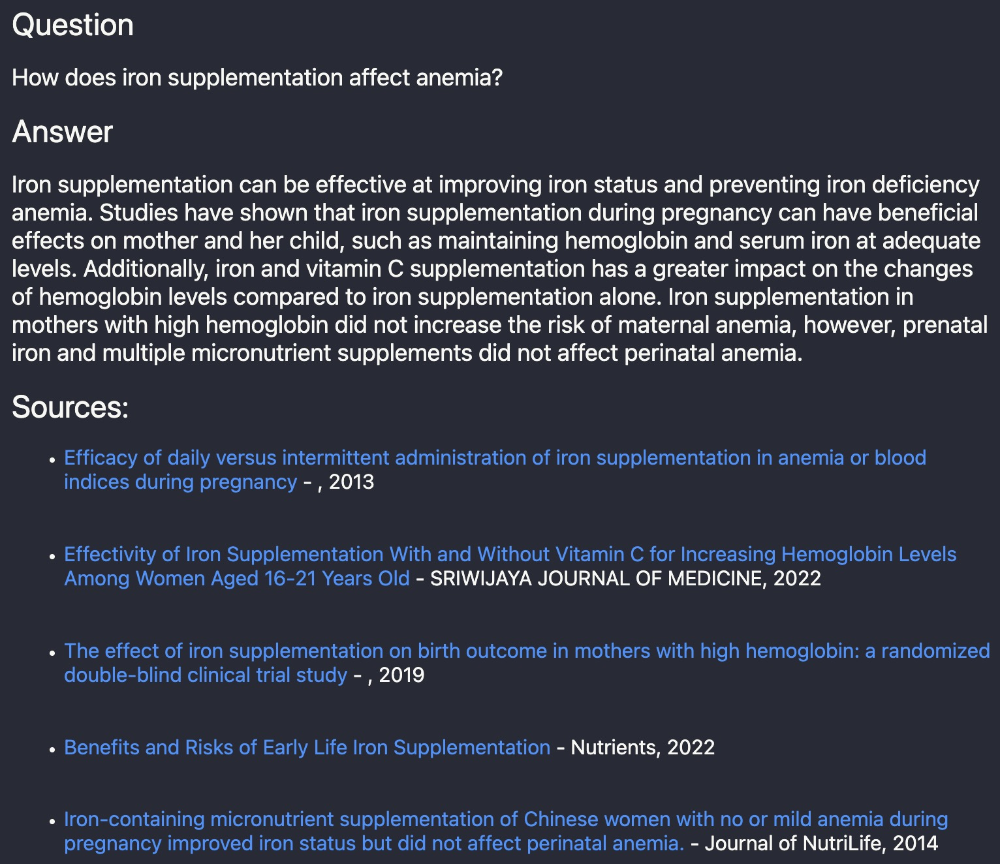

# 📚🤖 S2QA: Question Answering on research papers from Semantic Scholar

Have you ever wondered what research papers have to say about your burning questions? Look no further than Semantic Scholar Q&A with GPT-3! 🙌

This Python script lets you enter a question, and it uses the power of Semantic Scholar and GPT-3 to generate an answer based on the content of the top research papers. 🤖🔍


- [chat_qa.ipynb](notebooks/chat_qa.ipynb) ⭐ sends the context to ChatGPT(using revChatGPT) for generating answers. This gives the best answers and is free. Seems less prone to hallucinations than other pipelines in this repo. 
- [utils.py](notebooks/utils.py) - has all the necessary functions for search and GPT-3  prompting
- [s2qa_sources_langchain.ipynb](notebooks/s2qa_sources_langchain.ipynb) - Get better answers with langchain mapreduce but this is very expensive. Prone to hallucinations.
- [s2qa_nb.ipynb](notebooks/s2qa_nb.ipynb) - first notebook. Very basic QA. Prone to hallucinations.

# 🚨 Caution ⚠️
Caution should be exercised when using generative AI for scientific text, as the output generated by such models may not be rigorously fact-checked or peer-reviewed, and may therefore contain errors or inaccuracies that could mislead researchers and readers. Be responsible and use this tool with caution.


# Examples

## 🤖 Getting answers from ChatGPT 

##  Demo - 
[chat_qa.ipynb](notebooks/chat_qa.ipynb)

----
## Question

### what is the impact of transformers on language

## ChatGPT Response:

Transformers have had a significant impact on language in a variety of ways. One of the most prominent areas of impact is in natural language processing (NLP), which has been revolutionized by the development of transformer-based language models. These models have been used for a variety of NLP tasks, including machine translation [[1](https://www.semanticscholar.org/paper/3d67a1fd78c7e74813e898b67fa5965a7d2ce25e)], code summarization [[2](https://www.semanticscholar.org/paper/761472e1c6012e001438d22ef771a0defbac3695)], detecting patronizing and condescending language [[3](https://www.semanticscholar.org/paper/36f7da6d848070f74b48bdf2accace00a66202a3)], and spoken language understanding tasks [[4](https://www.semanticscholar.org/paper/0de905634bd3d42a612ffab7ddd7a814e7e655bb)].

Moreover, transformer-based models have been shown to be effective in domain adaptation for bidirectional transformers [[7](https://www.semanticscholar.org/paper/314107f8ff8bc134703c49c012ea6f6d9eb17840)], multi-modal transformer models have been explored for image captioning [[8](https://www.semanticscholar.org/paper/bec1f88b86bd06e90e2d735be9c54f890ca5c66e)], and pre-training objectives have been used in software engineering to boost performance in code-related tasks [[6](https://www.semanticscholar.org/paper/2e761fe1771d83962eacb7acc473d132bf92b1d3)]. Additionally, transformers have also been used to incorporate document timestamps into language models, which has shown to have a positive impact on downstream classification tasks and masked language modeling [[5](https://www.semanticscholar.org/paper/a702e0a38086c54c65ef7f2290eea726e13e0ca7)].

Overall, transformers have had a significant impact on language, particularly in the field of natural language processing, where transformer-based models have been used for a variety of tasks with great success. They have also been explored in other areas such as software engineering and image captioning, showing the versatility of the technology.

#### [1]  [A Study on the journey of Natural Language Processing models: from Symbolic Natural Language Processing to Bidirectional Encoder Representations from Transformers](https://www.semanticscholar.org/paper/3d67a1fd78c7e74813e898b67fa5965a7d2ce25e)  - International Journal of Scientific Research in Computer Science Engineering and Information Technology, 2021

#### [2]  [Code Summarization: Do Transformers Really Understand Code?](https://www.semanticscholar.org/paper/761472e1c6012e001438d22ef771a0defbac3695)  - , 2022

#### [3]  [PALI-NLP at SemEval-2022 Task 4: Discriminative Fine-tuning of Transformers for Patronizing and Condescending Language Detection](https://www.semanticscholar.org/paper/36f7da6d848070f74b48bdf2accace00a66202a3)  - International Workshop on Semantic Evaluation, 2022

#### [4]  [Benchmarking Transformers-based models on French Spoken Language Understanding tasks](https://www.semanticscholar.org/paper/0de905634bd3d42a612ffab7ddd7a814e7e655bb)  - Interspeech, 2022

#### [5]  [Temporal Language Modeling for Short Text Document Classification with Transformers](https://www.semanticscholar.org/paper/a702e0a38086c54c65ef7f2290eea726e13e0ca7)  - Conference on Computer Science and Information Systems, 2022

#### [6]  [Automating Code-Related Tasks Through Transformers: The Impact of Pre-training](https://www.semanticscholar.org/paper/2e761fe1771d83962eacb7acc473d132bf92b1d3)  - ArXiv, 2023

#### [7]  [Exploiting Auxiliary Data for Offensive Language Detection with Bidirectional Transformers](https://www.semanticscholar.org/paper/314107f8ff8bc134703c49c012ea6f6d9eb17840)  - WOAH, 2021

#### [8]  [What Does a Language-And-Vision Transformer See: The Impact of Semantic Information on Visual Representations](https://www.semanticscholar.org/paper/bec1f88b86bd06e90e2d735be9c54f890ca5c66e)  - Frontiers in Artificial Intelligence, 2021

---

## 🤖 Answers with sources and langchain mapreduce

<!--  -->



## 🤖 Answers with regular "stuffing" context

```python
>> query = "How does iron supplementation affect anemia?"

>> answer_question(df, question=query, debug=False)

'Iron supplementation can reduce anemia in pregnant women with mild or no anemia, but it can also increase the risk of neonatal jaundice. Iron supplementation can also improve iron stores and decrease anemia in non-pregnant women, but it can also increase the risk of diarrhea. Good adherence and initiation of supplementation before conception are needed to reduce anemia during early pregnancy.'
```

```python
>> query = "What are the effects of sleep training on infants?"

>> answer_question(df, question=query, debug=False)

'Sleep training can lead to improved sleeping patterns, decreased parental stress, and increased parental competence. It can also lead to improved sleep efficiency, sleep onset latency, and sleep duration.'
```


---

## Requirements 🧰

- `OpenAI API key` (if you are using langchain)
- `Semantic Scholar Academic Graph API key` - https://www.semanticscholar.org/product/api
- `OpenAI credentials` (if you are using revChatGPT) - email and password

These can be added in the [constants.py](notebooks/constants.py)

The main third-party package requirements are `revChatGPT`, `tiktoken`, `openai`, `transformers` and `langchain`.

To install all the required packages
```
pip install -r requirements.txt
```

## Pipeline 🚀

1️⃣ `Searching` : We begin by searching the vast and ever-growing database of Semantic Scholar to find the most up-to-date and relevant papers and articles related to your question.

2️⃣ `Re-Ranking` : We then use [SPECTER](https://github.com/allenai/specter) to embed these papers and re-rank the search results, ensuring that the most informative and relevant articles appear at the top of your search results.

3️⃣ `Answering` : Finally, we use the powerful natural language processing capabilities of GPT-3 to generate informative and accurate answers to your question, using custom prompts to ensure the best results.

## Customizable 🖊️

- Try other open embedding methods on huggingface to see better re-ranking results. 

- Try other prompts or refine the current prompt to get even better answers.

## TODO 👈

- ~~Add citations to the statements generated by GPT-3. As we have links to the actual paper this shouldn't be hard to do.~~ See [s2qa_sources_langchain.ipynb](notebooks/s2qa_sources_langchain.ipynb)
- Evaluate for some questions from ChatGPT. Report results